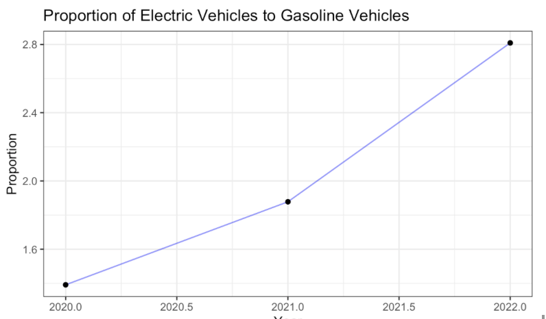
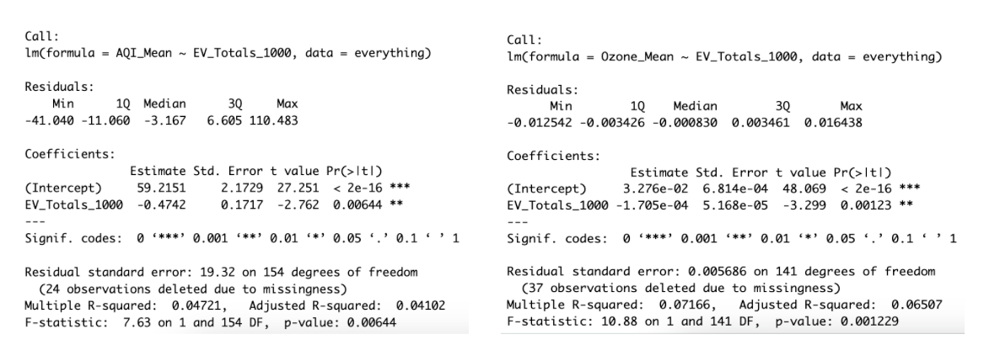

## The Implication of Electric Vehicles Adoption in California for Air Pollution

To assess the relationship between the adoption of zero-emission vehicles and the reduction of air pollution in California, correlations between average county pollutant levels measured at Federal Reference Method (FRM) air monitoring sites and total zero-emission vehicle sales and registrations were analyzed over the three-year period of 2019 - 2022. This analysis comprised three parts: correlation, regression, and regression trees.

# Introduction

Electric vehicles offer several advantages, including reduced emissions, improved energy efficiency, and decreased reliance on fossil fuels. An article titled "California’s early transition to electric vehicles" on sciencedirect.com highlights the health benefits of EVs. The study analyzed real-world data from California and found that areas with more electric vehicle registrations had lower pollution and fewer asthma-related emergency room visits. Increasing the proportion of electric vehicles could lead to a 3.2% annual decrease in asthma-related ED visits. Additionally, another article on sciencedirect.com, "Air Quality impacts from electrification of Light-Duty passenger vehicles in the United States," examined the impact of EVs on air quality. It considered the source of energy generation and found that the net benefit of EVs varied by region, but overall, the transition to electric transportation reduced air pollution, even when accounting for energy generation from fossil fuels. These findings are important for informing environmental policies.

The data was analyzed in a three step regression process: correlation, linear regression, and regression trees.

# Results

Analysis of EV sales and population, and analysis of the correlation between total registered vehicles with the selected air pollutants. When I analyzed the electric vehicle sales and registration data sourced from the California Department of Energy, it was observed that both number of sales and registered vehicles showed an increase year over year from 2020-2021. When comparing the total number of registered EV to that of combustion vehicles, the proportion also increased every year going from 1.39% in 2020, to 1.87% in 2021 and 2.81% in 2022. This proportion doubling during the span of two years suggests that more people are buying electric vehicles in comparison to the counterpart. Something interesting that I noticed during this part of my study is that in 2022, the total number of registered combustion vehicles actually decreased. 

Also, it suggested that an increase in registered electric vehicles correlated to a decrease in the value of Ozone and AQI, but it did not seem to have an effect on NO2 nor HAPS.To back this up, the figure below shows the p-value, t- value and correlation coefficient for all of the pollutants of interest and I concluded that at a 5% significance level, for the null hypothesis of the mean being 0, we can reject it for AQI and Ozone.

Additionally, the linear regression  performed in R for AQI and Ozone mean yielded a very small r square for the statistic,  suggesting that  there is a relation between the the population of electric vehicles and AQI and Ozone, even if it is not a very strong one

Lastly, the results of the Decision Tree showed that if a county has a number of electric vehicles greater or equal to that 14.07 EV per 1000 people, I would expect to see an AQI of 44.76. If the number of EV is less than 14.07, the AQI. I could expect to see is 57.54. On the other hand, for any county that has greater than or equal to 21.84 EV per 1000, I would expect to see ozone levels of 0.02571, otherwise, 0.03174. Therefore, as presented by these results, I can say that the increase in the total number of EV could help decrease the levels of AQI and Ozone which would improve air quality overall.

# Conclusion

This study shows that increasing electric vehicle (EV) adoption is associated with improved Air Quality Index (AQI) and Ozone Levels, benefiting air quality. However, it does not find a significant link between EV adoption and Nitrogen Dioxide (NO2) and Hazardous Air Pollutants (HAPS) levels. Other variables like wildfires, geography, and unknown factors may affect pollution dynamics in regions like California. The decline in gas combustion car registrations alongside rising EV numbers indicates a positive shift toward sustainable transportation. To better understand the relationship between air pollution and EVs, future research should consider factors like city density, weather conditions, and energy sources. This study highlights the complexity of pollution dynamics, emphasizing the need for ongoing research and informed policies to promote cleaner urban environments through sustainable transportation.

# References
https://www.epa.gov/haps/what-are-hazardous-air-pollutants
https://www.airnow.gov/aqi/
https://www.census.gov/data/datasets/time-series/demo/popest/2020s-counties-total.html
https://www.energy.ca.gov/data-reports/energy-almanac/zero-emission-vehicle-and-infrastructure-statistics
